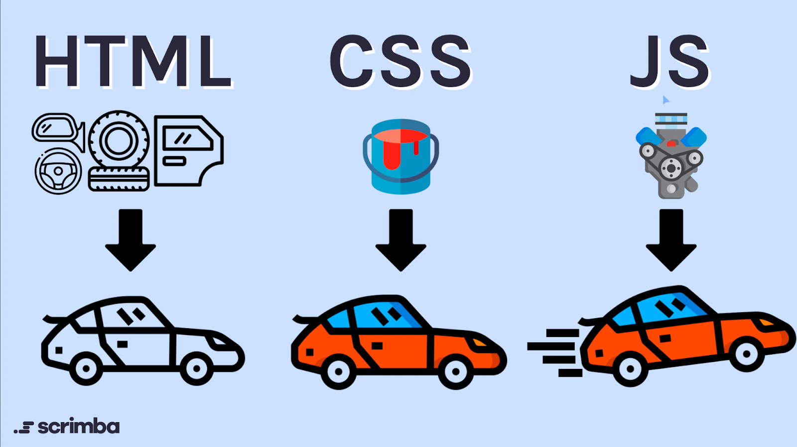

---
presentation:
  width: 1500
  height: 900
  theme: night.css
---

<!-- slide -->

## HTML, CSS, JS



---

<!-- slide -->
## O que é HTML ?
* Não é uma linguagem de programação e sim uma linguagem de marcação que define a estrutura de um projeto

```html
    <h1>Meu título principal</h1>
    <h2>Meu título de alto nível</h2>
    <h3>Meu subtítulo</h3>
    <h4>Meu segundo subtítulo</h4>
```

---

<!-- slide -->

## O que é CSS ?

* Assim como o HTML não é uma linguagem de programação e sim uma linguagem de estilos

```CSS
p {
  color: red;
}
```
---
<!-- slide -->

## O que é JS ?

* É uma linguagem de programação que adiciona interatividade a um site

```js
const myHeading = document.querySelector("h1");
myHeading.textContent = "Olá mundo!";

```
---